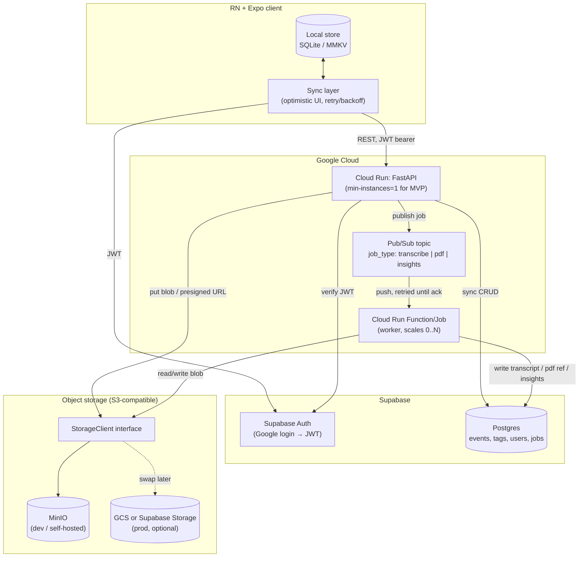

# LimON — Backend Architecture & MVP Implementation Plan

## Context

LimON is a PTSD event-tracking app: a React Native + Expo client and a FastAPI
backend. Functional requirements are largely settled; the open questions are
**architecture** — how data flows (sync vs. async), what compute to run on GCP
(Cloud Run vs. Cloud Run Functions vs. always-on GKE), whether a message bus is
needed, and how the app stays responsive despite serverless cold starts.

The current backend is a clean, fully-async FastAPI app with three resources
(events, tags, users), SQLite via `aiosqlite`, tables created at startup (no
migrations), and MinIO scaffolding in `docker-compose.yml` that **no app code
reads yet** (`LIMON_S3_*` env vars are already correctly named — MinIO speaks
the S3 API — but `config.py` has no S3 settings, so they're silently dropped).

**Update since this document was first drafted:** Supabase JWT auth landed on
`main` (`app/core/auth.py`, `9e090e6`/`e71f872`) — ahead of and independent of
this plan being finalized. It implements Steps 0/1 below (and a bit more:
`/users/me` GET/PATCH/DELETE, tags fully user-scoped). Part 2 has been updated
to mark that as done; **events user-scoping (Step 3), Postgres, storage, and
the async job pattern are still ahead.** There is still no storage client, no
queue, no background work, and the DB is still SQLite.

**Decisions locked in with the user:**
- **Compute:** single Cloud Run service for all sync CRUD; offload only heavy
  work to Cloud Run Functions/Jobs. (Not per-service split, not always-on GKE.)
- **Data store:** **Supabase (Postgres)** + Supabase **built-in auth** — this
  replaces the "build OAuth ourselves" path and likely the SQLite dev DB.
- **Client UX:** **local-first + optimistic UI** — RN writes locally and
  instantly, a sync layer reconciles with the backend in the background.
- **Async features to design for:** voice-note transcription, PDF export,
  insights — all via one reusable async-job pattern.
- **Scope:** this is a design document **plus** concrete near-term backend steps.

The intended outcome: a shared mental model of the system and an ordered,
low-risk path from today's code to an MVP that scales down to ~$0 at rest and
up gracefully later.

---

## Part 1 — How apps like this are commonly built (the concepts)

### The two-speed data model

Split every operation into **fast/synchronous** and **slow/asynchronous**:

- **Fast path (request/response):** create/edit/delete events, tags, profile;
  list timeline. These are cheap DB reads/writes. Target: the Cloud Run service
  answers directly, in tens of ms once warm.
- **Slow path (fire-and-forget + result later):** transcription, PDF export,
  insights. The API's job is only to **accept the request, enqueue it, and
  return immediately** with a job/resource id. A separate worker does the work
  and writes the result somewhere the client can later fetch.

The client never blocks on the slow path. It shows the item as "processing" and
updates it when the result arrives (poll a status field, or receive a push).

### Cloud Run cold-start & scaling — answering your specific questions

**When does a Cloud Run *instance* go up?** When a request arrives and no warm
instance can serve it. If scaled to zero, the *first* request pays a **cold
start** (container boot + app init) — typically ~0.5–3s for a Python/FastAPI
image. Subsequent requests reuse the warm instance.

**When does it scale to 0?** After a period with no traffic (default idle
window), Cloud Run tears instances down. That's the cost win — and the cold-start
cost. You control this trade-off with **`min-instances`**: `min-instances=0`
means true scale-to-zero (cheapest, cold starts possible); `min-instances=1`
keeps one instance always warm (a few $/month, no cold start on the hot path).

**"User adds a tag, an instance needs to spin up — what makes the UX feel
instant while we wait?"** This is exactly why we chose **local-first**:

1. RN writes the tag to a **local store** (SQLite/MMKV) and updates the UI
   **immediately** — the user sees it done in <16ms, regardless of backend state.
2. A background **sync layer** sends the mutation to the API. If the instance is
   cold, the request simply takes ~1–2s longer — invisible, because the UI
   already moved on.
3. On success, reconcile (e.g. swap a temporary client id for the server id).
   On failure, retry with backoff; on hard conflict, surface a subtle indicator.

So **nothing "waits for Cloud Run to be up" in the user's experience** — the
local store absorbs the latency. For the MVP you can additionally set
`min-instances=1` to remove cold starts on the CRUD service entirely for a
trivial cost.

**"What handles waiting until a Cloud Run *Function* is up?" (transcription/PDF)**
Nobody waits synchronously. The flow is:

- Client uploads the audio (or requests a PDF) → API stores the blob / creates a
  job row with `status=pending` → **publishes a Pub/Sub message** → returns
  immediately.
- **Pub/Sub push subscription** invokes the Cloud Run Function/Job. If it's cold,
  Pub/Sub's own **retry/backoff + at-least-once delivery** handles the wait —
  the message is redelivered until the function ack's it. The user isn't in the
  loop; they see "transcribing…" and the field fills in when done.
- Worker writes the result (transcript text to DB; PDF blob to storage) and sets
  `status=done`. Client learns via status poll or push notification, then fetches
  the PDF through a **pre-signed URL**.

### Do we need Pub/Sub (or another broker)?

**For MVP:** minimally. Two viable patterns:

- **Pub/Sub (recommended for the async features):** durable queue, automatic
  retries, decouples API from workers, scales cleanly. Use it as the single
  "job queue" for transcription, PDF, and insights. This is the standard GCP
  answer and what the plan builds toward.
- **FastAPI `BackgroundTasks` (only as a stopgap):** runs work in the same Cloud
  Run instance after responding. Simple, but the work dies if the instance is
  reclaimed and doesn't scale independently — **not** suitable for 60s
  transcription or PDF. Acceptable only for tiny best-effort tasks.

Recommendation: **one Pub/Sub topic + one worker service** implementing the
reusable job pattern; all three heavy features publish to it with a `job_type`.

### Where Supabase fits

- **DB:** Supabase = managed **Postgres**. Our SQLAlchemy async stack ports to it
  by switching the driver to `asyncpg` (`postgresql+asyncpg://…`). Note two
  code touch-points that are **SQLite-specific today** and must change:
  the `PRAGMA foreign_keys` connect-listener (Postgres enforces FKs natively)
  and the **`json_each` tag filter** in `services/events.py` (rewrite with a
  Postgres JSONB containment operator, or model event↔tag as a real relation).
- **Auth:** Supabase Auth issues **JWTs** (Google login included). The backend
  stops "creating users via POST" and instead **verifies the Supabase JWT** on
  each request, provisioning a local user row on first sight (JIT) using the
  existing `get_user_by_provider_subject` service method — the `users` model's
  `provider`/`provider_subject` columns already anticipate this.
- **Storage:** **Both MinIO and Supabase are in the design** — they play
  different roles and don't compete. Supabase = Postgres + Auth. **MinIO is the
  S3-compatible blob store** (already wired in compose, bucket `limon`,
  `LIMON_S3_*` env vars) for audio and generated PDFs — that naming is already
  correct and stays as-is; we're just making `config.py` read it.
  All blob access goes through a **storage abstraction layer** (an interface,
  not a MinIO-specific client): the app talks to `StorageClient.put_object()` /
  `generate_presigned_url()`, and a concrete `S3StorageClient` implementation
  (boto3-compatible) is configured to point at MinIO today. Because the
  interface is the S3 API shape, swapping the concrete client to AWS S3, GCS
  (via its S3-compat mode), or Supabase Storage later is a config/adapter
  change, not an app-code change.

### Reference architecture (MVP)

Two things this diagram makes explicit: (1) the client's `SYNC` layer is the
only thing that talks to the network — `LOCAL` is what the user actually sees,
so backend latency (cold start or otherwise) never blocks the UI; (2) `WORKER`
never touches the client directly — it only writes results into Postgres/
storage, and the client learns about them via polling or push, not a held-open
request.

### Scaling path (later, not MVP)
- Raise Cloud Run `max-instances`, add concurrency tuning.
- Split the worker into per-`job_type` services if load demands it.
- Only consider GKE/always-on if you hit sustained high traffic where per-request
  serverless economics stop making sense — unlikely at MVP/early stage.

---

## Part 2 — Concrete implementation steps: a walking skeleton, built with TDD

**Approach:** every milestone below is a *walking skeleton* step — a thin
end-to-end slice that you can actually run and observe (curl it, load a
screen, see a row in Supabase) before more depth gets added anywhere. Nothing
is "build the whole backend, then wire the client" — each step touches
client + backend + infra just enough to prove that layer works, then the next
step deepens it. This also keeps early risk (auth, Postgres, cold starts)
resolved first, before investing in features that depend on them.

**TDD within each step:** for every backend behavior added, write the test
first against the layer it belongs to — a service-level test for business
logic (e.g. "job transitions pending→done"), a router-level test via the
existing `httpx.AsyncClient` pattern for HTTP contract (status codes, auth
enforcement, 404/409s). Red → green → refactor, using the existing
`tests/conftest.py` in-memory-DB fixture as the base. Steps 1+ add a Postgres
(Supabase) test path once that's live. Each numbered step below ends with an
explicit "you should be able to see/do X" checkpoint — that's the TDD-to-UX
bridge: tests prove correctness, the checkpoint proves it *feels* real.

Each step maps to an issue/branch (`issue-<n>-<slug>` per the repo's branch
convention).

### Step 0/1 — Auth + JIT user provisioning — **done** (`app/core/auth.py`)
Implemented ahead of this document (see `9e090e6 feat: integrate Supabase
authentication with JWT verification` and the follow-up JWKS/proxy fix
`e71f872`). What landed matches — and extends — the originally planned
walking-skeleton slice:
- `get_current_user` (`app/core/auth.py`) verifies the Supabase access token
  against its JWKS endpoint (RS256/ES256) or a configured HS256 shared secret
  for legacy projects, and 401s with `WWW-Authenticate: Bearer` on failure.
  Misconfiguration (`LIMON_SUPABASE_URL` unset) is a deliberate 500, not a 401
  — the caller did nothing wrong.
- `get_or_create_user` (`app/services/users.py`) does JIT provisioning keyed on
  `(provider, provider_subject)`; profile fields are seeded only at creation
  and never overwritten by later token claims (so a user's `PATCH /users/me`
  edits stick).
- `GET/PATCH/DELETE /users/me` (`app/routers/users.py`) replaced self-service
  `POST /users` entirely — identity always comes from the verified token, the
  API never takes a user id from the client. Delete cascades tags (`ON DELETE
  CASCADE` on `Tag.user_id`).
- Tags are already fully user-scoped (`CurrentUserDep` on every route in
  `app/routers/tags.py`).
- Events are gated by auth (`dependencies=[Depends(get_current_user)]` on the
  router) but **not yet scoped by owner** — see Step 3.
- Tests: `tests/test_auth.py` covers token verification; `tests/conftest.py`
  carries the signed-JWT fixture used across routers.

**Remaining from the original Step 0/1 checkpoint:** wiring the Expo "Sign in
with Google" screen against this (client-side work, not yet started).

### Step 2 — Postgres/Supabase as the real DB (swap the foundation under CI)
- Add `asyncpg`; point `LIMON_DATABASE_URL` at Supabase Postgres for dev.
  Keep the SQLite in-memory fixture for fast unit tests; add a Postgres-backed
  test path (or a local `postgres` compose service) for integration tests —
  TDD here means writing the test that would have caught the `json_each`
  SQLite-only bug *before* fixing it.
- `app/db/session.py`: confirm the `PRAGMA foreign_keys` listener no-ops on
  Postgres (dialect-gated already — add a test for the gate itself).
- `app/services/events.py`: replace the `json_each` tag filter — promote
  event↔tag to a real many-to-many (fixes both the Postgres portability bug
  and the fact that `Tag` and `Event.tags` are unrelated today). Test-first:
  "filter events by tag" against Postgres.
- Introduce **Alembic**, replacing `create_all` in the `main.py` lifespan.
- **Checkpoint:** same app, same tests green, but `uv run uvicorn` now reads
  and writes through Supabase — inspect rows live in the Supabase dashboard.

### Step 3 — User-scoped events (the one piece Step 0/1 left open)
- Add `user_id` to `Event` (mirroring `Tag.user_id`); scope every
  `app/services/events.py` query by the authenticated user. Test-first: "user
  A cannot see/edit/delete user B's events" (403/404), for every route —
  today `app/routers/events.py` only gates on *being* authenticated, not on
  *owning* the event (see the comment already left in that file).
- **Checkpoint:** sign in as two different Google accounts (two devices/
  simulators), confirm each sees only their own timeline.

### Step 4 — Storage abstraction + first blob (MinIO wired, proven)
- Add S3 settings to `app/core/config.py` (`s3_endpoint_url`, `s3_access_key`,
  `s3_secret_key`, `s3_bucket`) reading the existing `LIMON_S3_*` compose vars.
- Define a `StorageClient` **interface** (`put_object`, `get_object`,
  `generate_presigned_url`) in `app/services/storage.py`, with a concrete
  `S3StorageClient` (boto3/`aioboto3`) implementation. Test-first against the
  interface using a real MinIO in compose (or `moto` for unit tests) — tests
  should not know or care that it's MinIO under the hood.
- Add one real usage: a minimal `POST /events/{id}/attachment` that stores a
  file and returns a pre-signed GET URL.
- **Checkpoint:** upload a file via `/docs` or curl, get back a URL, open it
  in a browser and see the file — proves MinIO + the abstraction layer work
  end-to-end, before voice notes need it.

### Step 5 — Async job pattern (one pattern; prove it with the simplest job)
- New `jobs` table: `id, user_id, job_type, status(pending|running|done|failed),
  result_ref, error, timestamps`. Test-first: service-level state machine
  tests (valid transitions only).
- `POST` endpoints that create a job + publish to Pub/Sub, return immediately;
  `GET /jobs/{id}` for polling. Router test: assert the POST response is
  immediate (job `pending`) without waiting on worker completion.
- Worker entrypoint consuming Pub/Sub (local: Pub/Sub emulator in compose, or
  a stubbed in-process consumer behind the same interface for tests).
- **Build the *insights* job first** — it's the simplest (pure aggregation
  over existing data, no external API, no file upload) — to prove the whole
  pattern before the two harder jobs reuse it.
- **Checkpoint:** POST a job, immediately see `status=pending` in the
  response, watch it flip to `done` in Postgres/via polling a few seconds
  later, with a real insights result attached.

### Step 6 — PDF export (reuses Step 4 storage + Step 5 job pattern)
- Worker branch for `job_type=pdf`: query timeline (default 1 week), render,
  store via `StorageClient`, set `result_ref`. Test-first: given fixed events,
  assert a PDF blob is produced and the job resolves to `done`.
- **Checkpoint:** request an export, poll to `done`, download via the
  pre-signed URL, open the PDF.

### Step 7 — Voice note transcription (reuses Step 4 + Step 5, adds STT)
- Client records ≤60s audio, uploads via Step 4's storage endpoint pattern.
- Worker branch for `job_type=transcribe`: fetch blob → STT → write transcript
  onto the event. Test-first with a stubbed STT client (don't hit a real STT
  API in unit tests).
- **Checkpoint:** record a voice note in the app, watch the event's text field
  fill in with the transcript within ~60s.

### Step 8 — Deploy topology & docs
- Cloud Run service for the API (`min-instances=1` for MVP), Cloud Run
  Function/Job for the worker, Pub/Sub topic+subscription, Supabase project,
  MinIO (or GCS) in prod.
- Update `CLAUDE.md`: DB=Supabase/Postgres, auth=Supabase JWT, storage
  abstraction + MinIO, async job pattern, the two-speed data model.
- **Checkpoint:** the whole flow (Steps 0–7) works against deployed Cloud Run
  + Supabase, not just `localhost`.

---

## Files this touches (representative, not exhaustive)
- `app/core/auth.py`, `app/core/config.py` (`supabase_url`,
  `supabase_jwt_secret`) — **done** (Steps 0/1).
- `app/core/config.py` — S3 settings (reads existing `LIMON_S3_*`), Pub/Sub
  settings — still ahead.
- `app/db/session.py`, new `alembic/` — Postgres driver, migrations (Step 2).
- `app/services/events.py` — dialect-safe tag filtering / event↔tag relation;
  add `user_id` scoping (Steps 2–3).
- `app/models/`, `app/schemas/` — add `user_id` to events; new `job` model/schema.
- new `app/services/storage.py` — `StorageClient` interface + `S3StorageClient`
  (MinIO-backed) implementation (Step 4).
- new `app/services/jobs.py`, worker entrypoint (Step 5).
- `docker-compose.yml` — worker service + Pub/Sub emulator for local dev.
- `tests/` — Postgres-compatible fixtures, signed-JWT test fixture, storage
  interface tests (`moto` or real MinIO), job-flow tests.

## Verification
- **Per step:** each step's own checkpoint above is the primary verification —
  run it manually and confirm you see/feel the described result, in addition
  to `uv run pytest` staying green throughout (TDD tests written before each
  behavior, per step).
- **Auth (Step 0–1):** hit `/me` with/without a valid Supabase JWT; confirm 401
  vs. 200, and confirm JIT user creation happens exactly once per identity.
- **Postgres swap (Step 2):** confirm tag filtering works on Postgres — this is
  the regression test for the `json_each` SQLite-only bug.
- **Ownership (Step 3):** two different signed-in identities cannot read/write
  each other's events or tags.
- **Storage (Step 4):** round-trip a real file through MinIO via the
  abstraction — upload, get a pre-signed URL, fetch it back.
- **Async pattern (Steps 5–7):** POST a job → assert immediate `pending`
  response → run the worker → poll `GET /jobs/{id}` to `done` → fetch the
  result. Prove this once with insights (simplest), then confirm PDF and
  transcription reuse the same mechanics.
- **Cold-start UX (client, later):** with `min-instances=0`, confirm the RN
  local-first store shows a tag/event as done instantly while the sync request
  completes in the background.

---

## Appendix — Client build configuration (backend URL, environments)

The backend URL is **not discovered from Supabase or anywhere else at
runtime** — it's a build-time constant, same as in any client app.

- **Cloud Run gives the API a stable URL** at deploy time (e.g.
  `https://limon-api-<hash>-uc.a.run.app`, or a mapped custom domain like
  `api.limon.app`). This URL doesn't change as the service scales 0→N —
  scaling is entirely hidden behind it.
- **The Expo app has this URL baked in** as a build-time env var
  (`EXPO_PUBLIC_API_URL`), separate and independent from Supabase's own
  project URL (`EXPO_PUBLIC_SUPABASE_URL`, used only for direct Auth calls).
- **EAS Build profiles** (`eas.json`) are how different builds get different
  URLs — a `development` profile points at a dev Cloud Run service, a
  `production` profile points at prod, each baked in at `eas build --profile
  <name>` time. See [Expo's EAS Build variables docs](https://docs.expo.dev/build-reference/variables/)
  and [`eas.json` build profiles](https://docs.expo.dev/build/eas-json/).
- Recommended for later: map a custom domain to Cloud Run so the backend URL
  never has to change even if the underlying service is redeployed or moved.
